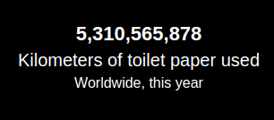

## MMM-TP

* Not really meant as a legitimate module. I did it for fun.

* However, it is staggering to consider the amount of "waste" the human race produces.

* Running counter of Toilet Paper used. Yes, you read that right! :-)

## Example

* Default white



## Installation

* `git clone https://github.com/mykle1/MMM-TP` into the `~/MagicMirror/modules` directory.

## Config.js entry and options

```
{
   disabled: false,
 module: "MMM-TP",
 position: "bottom right",
 config: {
   bgColor: "black",
   textColor: "white",
   fontSize: "20",
   height: "100px",
   width: "300px",
 }
},
```
